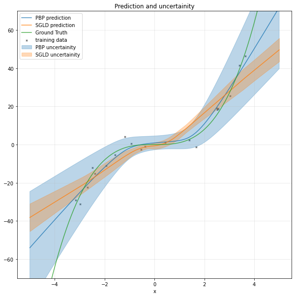
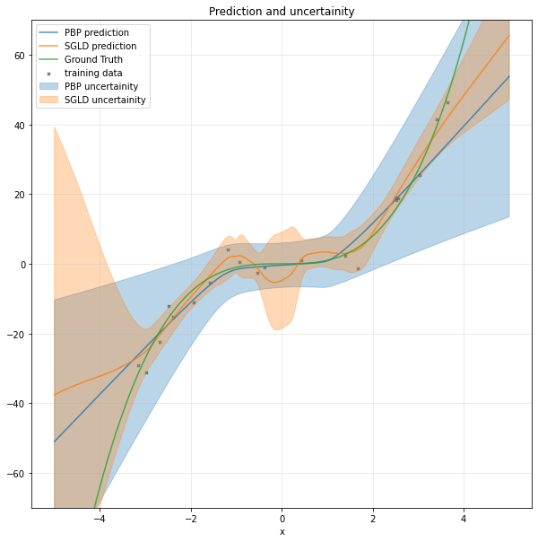
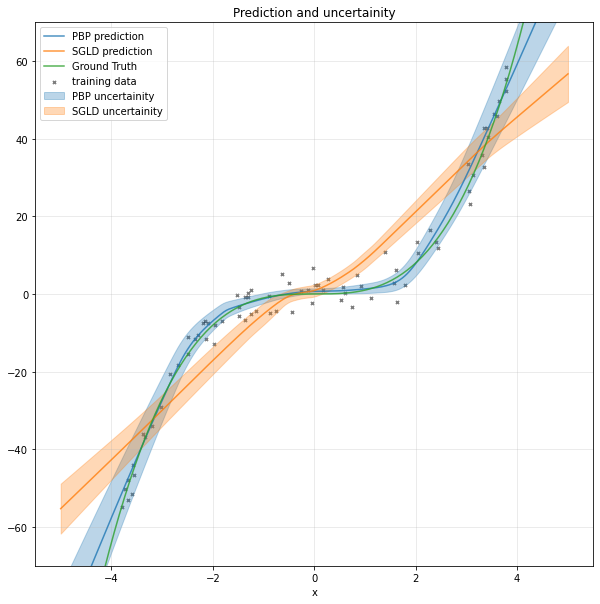
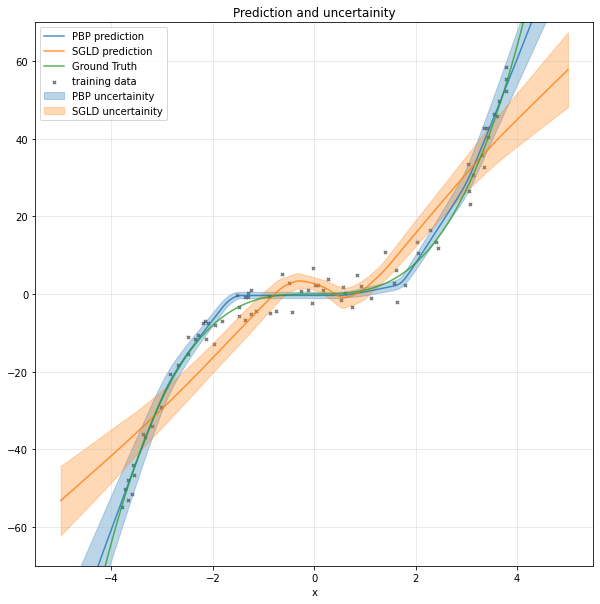
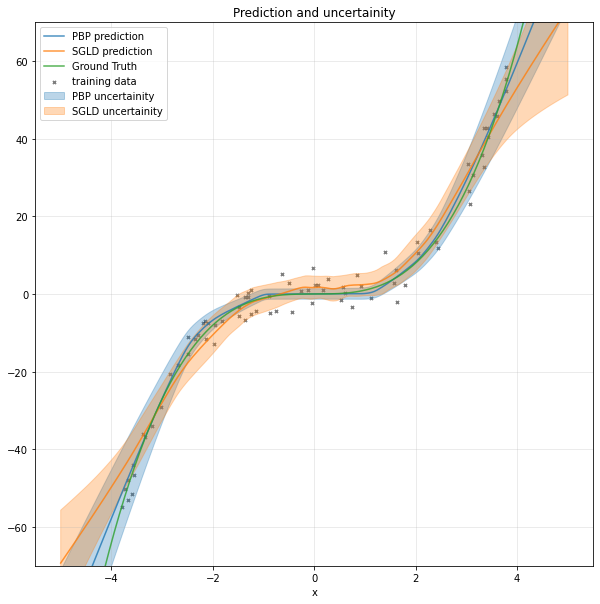

# Experiments and results for SGLD

SGLD params:

- num_nets = 1500
- mix_epochs = 50
- burnin_epochs = 20e3+1
- lr = 5e-5

## Dataset 1

20 points in training set

- x = np.random.uniform(-3.8, 3.8) 
- y = (x^3 + np.random.randn(x.shape[0], x.shape[1])*3)

### Experiment 1

Model details:

- num_hidden = 1
- hidden_units = 25

### Experiment 2

Model details:

- num_hidden = 1
- hidden_units = 50

### Experiment 3

Model details:

- num_hidden = 1
- hidden_units = 100

### Experiment 4

Model details:

- num_hidden = 2
- hidden_units = 25

### Experiment 5

Model details:

- num_hidden = 2
- hidden_units = 50

### Experiment 6

Model details:

- num_hidden = 2
- hidden_units = 100

## Dataset 2

80 points in training set

- x = np.random.uniform(-3.8, 3.8) 
- y = (x^3 + np.random.randn(x.shape[0], x.shape[1])*3)

### Experiment 1

Model details:

- num_hidden = 1
- hidden_units = 25

### Experiment 2

Model details:

- num_hidden = 1
- hidden_units = 50

### Experiment 3

Model details:

- num_hidden = 1
- hidden_units = 100

### Experiment 4

Model details:

- num_hidden = 2
- hidden_units = 25

### Experiment 5

Model details:

- num_hidden = 2
- hidden_units = 50

### Experiment 6

Model details:

- num_hidden = 2
- hidden_units = 100

## Dataset 3

- Using Gaussian distribution with std 1.0
- other params as exp5 of dataset 1

## Dataset 4

- Using Gaussian distribution with std 1.5
- other params as exp5 of dataset 1

